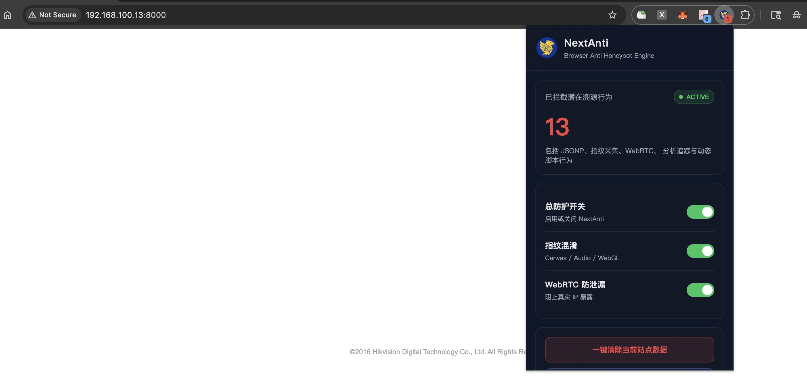

## NextAnti

> NextAnti 是一个基于 Chrome Manifest V3 的浏览器安全扩展，是一款专门用于反反蜜罐的插件

- 反追踪（Anti Tracking）
- 反指纹（Anti Fingerprint）
- 蜜罐检测（Honeypot Detection）
- 动态脚本监控
- WebRTC 防泄漏
- Tracker / Analytics 拦截
- 前端对抗与浏览器隐私保护

## Feat

- 基础反蜜罐检测，拦截 Analytics / Tracker
- Canvas 指纹对抗
- WebGL 指纹对抗
- Audio 指纹对抗
- WebRTC 阻断
- 动态 Script 检测
- 混淆 JS 检测
- 蜜罐特征检测

## Screenshot




## Install

打开：
```bash
chrome://extensions
```
开启：
```
开发者模式
```
点击：
```
加载已解压的扩展程序
```
选择：
```
NextAnti/
```

## Add Rule

修改：
```js
background.js
```
添加：
```json
{
    id: 999,
    host: 'example.com'
}
```
同时建议在：
```js
inject.js
```
中的：
```js
const BLACKLIST = [
```
也添加：
```
'example.com'
```

## References

项目部分源代码参考

- https://github.com/cnrstar/anti-honeypot
- https://github.com/Monyer/antiHoneypot
- https://github.com/iiiusky/AntiHoneypot-Chrome-simple
- https://github.com/wpexpertsio/cf7-honeypot
